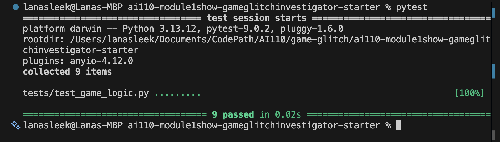
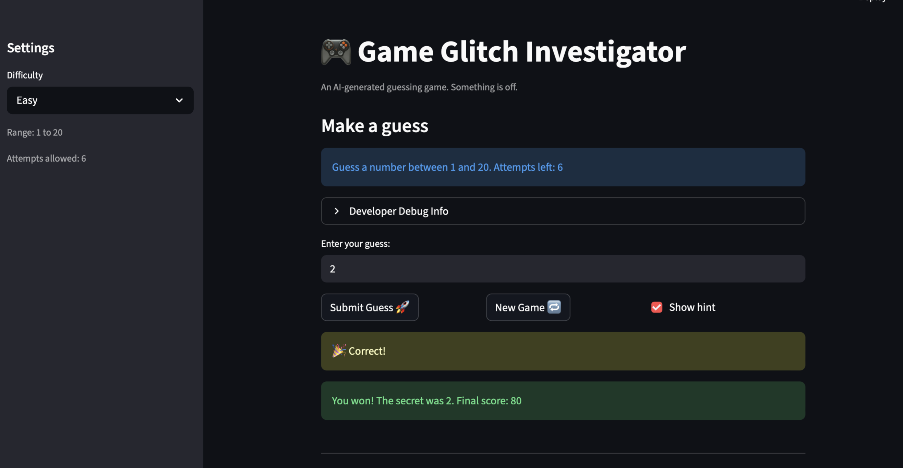
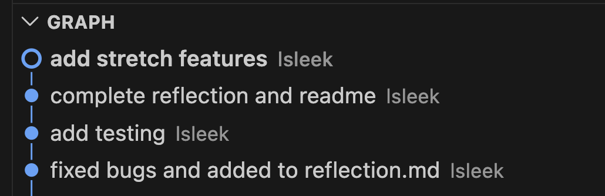
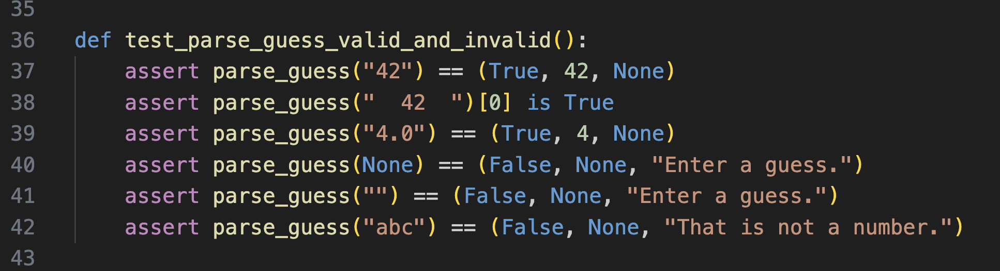
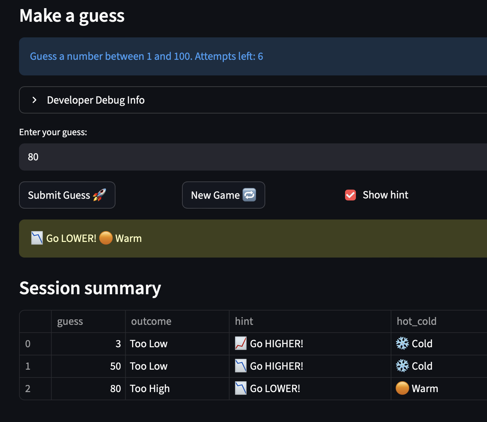
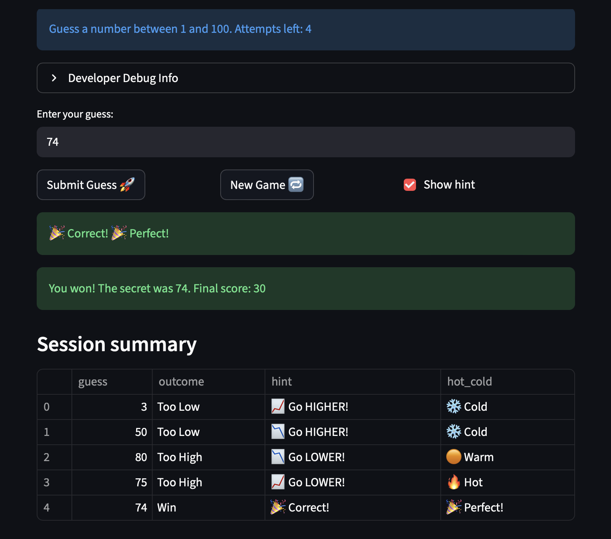

# 🎮 Game Glitch Investigator: The Impossible Guesser

## 🚨 The Situation

You asked an AI to build a simple "Number Guessing Game" using Streamlit.
It wrote the code, ran away, and now the game is unplayable. 

- You can't win.
- The hints lie to you.
- The secret number seems to have commitment issues.

## 🛠️ Setup

1. Install dependencies: `pip install -r requirements.txt`
2. Run the broken app: `python -m streamlit run app.py`

## 🕵️‍♂️ Your Mission

1. **Play the game.** Open the "Developer Debug Info" tab in the app to see the secret number. Try to win.
2. **Find the State Bug.** Why does the secret number change every time you click "Submit"? Ask ChatGPT: *"How do I keep a variable from resetting in Streamlit when I click a button?"*
3. **Fix the Logic.** The hints ("Higher/Lower") are wrong. Fix them.
4. **Refactor & Test.** - Move the logic into `logic_utils.py`.
   - Run `pytest` in your terminal.
   - Keep fixing until all tests pass!

## 📝 Document Your Experience

- ✅ **Describe the game's purpose:** This is a number-guessing game where the player must guess a secret number in a limited number of attempts. The game gives feedback on whether the guess is higher or lower than the secret.

- ✅ **Detail which bugs you found:**
  - Hint messages were inverted (too-high told the player to go higher and vice versa).
  - The attempt counter was off by one because it started at 1, making the UI show fewer remaining attempts.
  - Changing difficulty updated the displayed range but did not update the secret number generation range.

- ✅ **Explain what fixes you applied:**
  - Corrected the hint logic so hints match the actual comparison.
  - Initialized attempts to 0 and adjusted scoring so the first guess counts as attempt 1.
  - Made difficulty changes reset the game state and generate a new secret within the correct range.

## 📸 Demo
screenshots of working game with correct logic and testing

screenshot of git commits + messages

## 🚀 Stretch Features
1. I included more test cases that cover edge cases
 

2. Added structured, user-friendly output: hints now include color-coded messages and Hot/Warm/Cold emoji feedback.

3. Added a session summary table so players can see their guess history and outcomes in an easy-to-read format.

